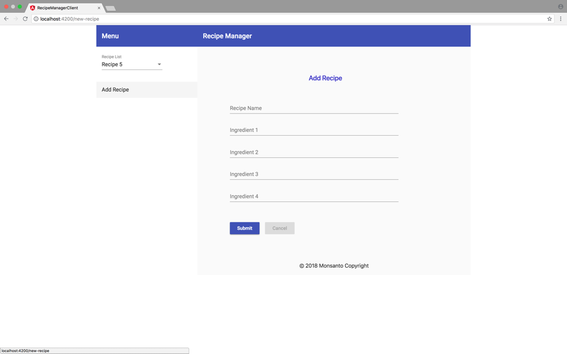

# RecipeManager
Repository for Monsanto Assignment.

# Application Flow

1. Welcome Page

2. Recipe List coming from Backend

3. Recipe 1 details

4. Recipe 5 details

5. Add New Recipe

6. Required fields

7. Fill Ingredients Detail

8. Success notification message after adding details correctly

9. Newly created recipe added to list of Recipe

10. Newly added Recipe details

11. Recipe validation while adding

12. Responsive design with toggle menu

13. Responsive design with toggle menu

14. Responsive design list of recipe 

15. Responsive design with add recipe

